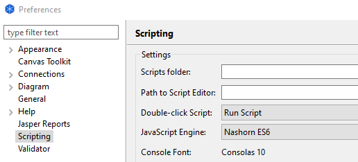
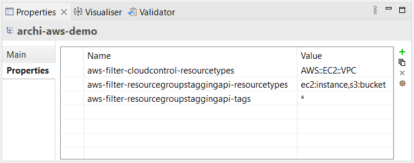
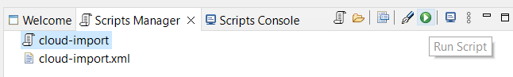
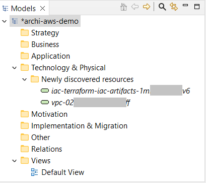

This is a companion script for [Archi® (the ArchiMate® tool)](https://www.archimatetool.com/)
which allows automatically populating your [ArchiMate® models](https://www.opengroup.org/archimate-forum/archimate-overview)
with elements reflecting AWS resources.

The script is supposed to leverage *Archi*'s [*specialization* feature](https://www.archimatetool.com/blog/2021/10/12/archi-4-9/).
As script sets element's *specialization* property to the AWS resource's type (in CloudFormation's notation),
it makes it possible to configure models with custom icons for those specialization resulting in [nice AWS architecture diagrams](https://www.archimatetool.com/blog/2021/10/12/archi-4-9/)
embedded into integral models of your enterprise, system or software. 

# Installation

## Prerequisites

1. Make sure you have [the jArchi plugin](https://www.archimatetool.com/plugins/#jArchi) installed.
1. Make sure that *Archi* is configured to use *Nashorn ES6* as the script engine.
*GraalVM* is not supported yet.
<br/>
1. Properly [configure a named profile for AWS CLI](https://docs.aws.amazon.com/cli/latest/userguide/getting-started-quickstart.html).

## Windows

Download [aws_sdk_dependencies/target/archi_aws_sdk-1.0-jar-with-dependencies.jar](./aws_sdk_dependencies/target/archi_aws_sdk-1.0-jar-with-dependencies.jar)

Copy ```archi_aws_sdk-1.0-jar-with-dependencies.jar``` to Archi's root folder.
```cmd
COPY %USERPROFILE%\Downloads\archi_aws_sdk-1.0-jar-with-dependencies.jar %USERPROFILE%
```

Edit ```C:\Program Files\Archi\Archi.ini```
<br/>Add the following line. (Replace *C:\Users\windows-user-name* with your user folder path.)
```
-Dnashorn.args=-cp C:\Users\windows-user-name\archi_aws_sdk-1.0-jar-with-dependencies.jar
```

Download https://github.com/MaksimAniskov/archi-aws/raw/v1.0/archi4_scripts/cloud-import.ajs
<br/>Move ```cloud-import.ajs``` to Archi's ```scripts``` folder.
```cmd
MOVE %USERPROFILE%\Downloads\cloud-import.example.xml %APPDATA%\Archi4\scripts\cloud-import.xml
```

Restart *Archi*.

## Linux

Download ```archi_aws_sdk-1.0-jar-with-dependencies.jar```
```sh
curl https://raw.githubusercontent.com/MaksimAniskov/archi-aws/v1.0/aws_sdk_dependencies/target/archi_aws_sdk-1.0-jar-with-dependencies.jar -o ~/archi_aws_sdk-1.0-jar-with-dependencies.jar
```

Edit ```~/Archi/Archi.ini```
<br/>Add the following line. (Replace */home/linux-user-name* with your home directory path.)
```
-Dnashorn.args=-cp /home/linux-user-name/archi_aws_sdk-1.0-jar-with-dependencies.jar
```

Download ```cloud-import.ajs```.
```sh
curl https://raw.githubusercontent.com/MaksimAniskov/archi-aws/v1.0/archi4_scripts/cloud-import.ajs -o ~/.archi4/scripts/cloud-import.ajs
```

Restart *Archi*.

## macOS

Download ```archi_aws_sdk-1.0-jar-with-dependencies.jar```
```sh
curl https://raw.githubusercontent.com/MaksimAniskov/archi-aws/v1.0/aws_sdk_dependencies/target/archi_aws_sdk-1.0-jar-with-dependencies.jar -o ~/archi_aws_sdk-1.0-jar-with-dependencies.jar
```

Edit ```/Applications/Archi.app/Contents/Eclipse/Archi.ini```
<br/>Add the following line.
(Replace */Users/macos-user-name* with your home directory path.)
```
-Dnashorn.args=-cp /Users/macos-user-name/archi_aws_sdk-1.0-jar-with-dependencies.jar
```

Download ```cloud-import.ajs```
```sh
curl https://raw.githubusercontent.com/MaksimAniskov/archi-aws/v1.0/archi4_scripts/cloud-import.ajs -o ~/Library/Application\ Support/Archi4/scripts/cloud-import.ajs
```

Restart *Archi*.

# Quick start

Download https://github.com/MaksimAniskov/archi-aws/raw/v1.0/archi4_scripts/cloud-import.example.xml

Move ```cloud-import.example.xml``` to Archi's ```scripts``` folder renaming it as *cloud-import.xml*

Windows:
```cmd
MOVE %USERPROFILE%\Downloads\cloud-import.example.xml %APPDATA%\Archi4\scripts\cloud-import.xml
```

Linux:
```sh
curl https://raw.githubusercontent.com/MaksimAniskov/archi-aws/v1.0/archi4_scripts/cloud-import.example.xml -o ~/.archi4/scripts/cloud-import.xml
```

macOS:
```sh
curl https://raw.githubusercontent.com/MaksimAniskov/archi-aws/v1.0/archi4_scripts/cloud-import.example.xml -o ~/Library/Application\ Support/Archi4/scripts/cloud-import.xml
```

Open ```cloud-import.xml``` for editing. Replace *profileName* and *region* attributes of *Configuration* element.
```
<Configuration>
    <AwsImport profileName="some-aws-cli-config-profile-name" region="eu-central-1"/>
</Configuration>
```

Download this demo model https://github.com/MaksimAniskov/archi-aws/raw/v1.0/quickstart/archi-aws-demo.archimate Open the model in *Archi*.

Check out the model's properties, expect to find the following properties there.




In the scripts manager select ```cloud-import``` script and run it.



Depending on the number of AWS resources you have in the account and region, it may take several minutes to complete.
While working, the script **does not** indicate its progress.
After the script run normally, expect to see in the scripts console output like on the screenshot below.
Otherwise, look for error messages.


Discovered resources get added to the *Technology & Physical/Newly discovered resources* folder of the model.



# Configuration in model's properties

## aws-filter-resourcegroupstaggingapi-resourcetypes
```
not present, or empty string - import all types, do not filter

aws-filter-resourcegroupstaggingapi-resourcetypes ::= <filter-expression> | <filter-expression> , ... | <filter-expression> ; ... | <filter-expression> \n ...
<filter-expression> ::= <resource-type> | <resource-type> , ...
<resource-type> ::= <service> | <service>:<resource>
```

Examples:
```
s3
s3:bucket
s3:bucket,lambda:function
```

## aws-filter-resourcegroupstaggingapi-tags

```
aws-filter-resourcegroupstaggingapi-tags ::= * | <filter> | <filter> ; ... | <filter> \n ...
<filter> ::= <tag-name> = | <tag-name> = <filter-expression> | <tag-name> = <filter-and-expression>
<filter-expression> ::= <tag-value> | <tag-value> , ...
<filter-and-expression> ::= <filter-expression> and ...
```

Examples:
```
aws:cloudformation:stack-name=
aws:cloudformation:stack-name=dev-photo-gallery
aws:cloudformation:stack-name=dev-photo-gallery;...
aws:cloudformation:stack-name=dev-photo-gallery\n...
aws:cloudformation:stack-name=dev-photo-gallery,demo-photo-gallery
Application=crm and Environment=production
Application=crm,erp and Environment=production; aws:cloudformation:stack-name=demo-photo-gallery
```

## aws-filter-cloudcontrol-resourcetypes

```
aws-filter-cloudcontrol-resourcetypes ::= <resourcetype> | <resourcetype> , ... | <resourcetype> ; ... | <resourcetype> \n ...
```

Examples:
```
AWS::EC2::VPC
AWS::EC2::VPC,AWS::ECS::Cluster
AWS::EC2::VPC;AWS::ECS::Cluster
```

### Most useful of the resource types supported by CloudControl
* AWS::EC2::VPC
* AWS::EC2::InternetGateway
* AWS::CloudFront::Distribution
* AWS::Route53::HostedZone
* AWS::Lambda::Function
* AWS::ECS::Cluster
* AWS::ECS::Service
* AWS::EKS::Cluster
* AWS::ECR::Repository
* AWS::EC2::EC2Fleet
* AWS::EC2::SpotFleet
* AWS::EC2::TransitGateway
* AWS::EC2::TransitGatewayPeeringAttachment
* AWS::EC2::TransitGatewayVpcAttachment
* AWS::DataSync::Agent
* AWS::Kinesis::Stream
* AWS::MemoryDB::Cluster
* AWS::RDS::DBProxy
* AWS::RDS::GlobalCluster
* AWS::Redshift::Cluster
* AWS::S3::AccessPoint

### Resource types tried and verified to work as of May 2022
* AWS::AccessAnalyzer::Analyzer
* AWS::ACMPCA::CertificateAuthority
* AWS::ApiGateway::ApiKey
* AWS::ApiGateway::ClientCertificate
* AWS::ApiGateway::DomainName
* AWS::ApiGateway::UsagePlan
* AWS::AppFlow::ConnectorProfile
* AWS::AppFlow::Flow
* AWS::AppIntegrations::DataIntegration
* AWS::AppIntegrations::EventIntegration
* AWS::ApplicationInsights::Application
* AWS::APS::Workspace
* AWS::Athena::DataCatalog
* AWS::Athena::NamedQuery
* AWS::Athena::WorkGroup
* AWS::AutoScaling::LaunchConfiguration
* AWS::Backup::Framework
* AWS::Backup::ReportPlan
* AWS::Batch::SchedulingPolicy
* AWS::Budgets::BudgetsAction
* AWS::Cassandra::Keyspace
* AWS::Cassandra::Table
* AWS::Chatbot::SlackChannelConfiguration
* AWS::CloudFormation::ModuleDefaultVersion
* AWS::CloudFormation::ModuleVersion
* AWS::CloudFormation::PublicTypeVersion
* AWS::CloudTrail::Trail
* AWS::CloudWatch::CompositeAlarm
* AWS::CodeArtifact::Repository
* AWS::CodeStarConnections::Connection
* AWS::Config::AggregationAuthorization
* AWS::CustomerProfiles::Domain
* AWS::DataBrew::Dataset
* AWS::DataBrew::Job
* AWS::DataBrew::Project
* AWS::DataBrew::Recipe
* AWS::DataBrew::Ruleset
* AWS::DataBrew::Schedule
* AWS::DataSync::Agent
* AWS::DataSync::LocationEFS
* AWS::DataSync::LocationFSxWindows
* AWS::DataSync::LocationHDFS
* AWS::DataSync::LocationNFS
* AWS::DataSync::LocationObjectStorage
* AWS::DataSync::LocationS3
* AWS::DataSync::LocationSMB
* AWS::DataSync::Task
* AWS::Detective::Graph
* AWS::Detective::MemberInvitation
* AWS::DevOpsGuru::NotificationChannel
* AWS::DynamoDB::GlobalTable
* AWS::EC2::CapacityReservationFleet
* AWS::EC2::CarrierGateway
* AWS::EC2::DHCPOptions
* AWS::EC2::EC2Fleet
* AWS::EC2::EgressOnlyInternetGateway
* AWS::EC2::FlowLog
* AWS::EC2::Host
* AWS::EC2::InternetGateway
* AWS::EC2::IPAM
* AWS::EC2::IPAMPool
* AWS::EC2::IPAMScope
* AWS::EC2::LocalGatewayRoute
* AWS::EC2::LocalGatewayRouteTableVPCAssociation
* AWS::EC2::NetworkAcl
* AWS::EC2::NetworkInsightsAccessScope
* AWS::EC2::NetworkInsightsAccessScopeAnalysis
* AWS::EC2::NetworkInsightsAnalysis
* AWS::EC2::NetworkInsightsPath
* AWS::EC2::NetworkInterface
* AWS::EC2::PrefixList
* AWS::EC2::RouteTable
* AWS::EC2::SpotFleet
* AWS::EC2::SubnetNetworkAclAssociation
* AWS::EC2::SubnetRouteTableAssociation
* AWS::EC2::TransitGateway
* AWS::EC2::TransitGatewayConnect
* AWS::EC2::TransitGatewayMulticastDomain
* AWS::EC2::TransitGatewayPeeringAttachment
* AWS::EC2::TransitGatewayVpcAttachment
* AWS::EC2::VPC
* AWS::EC2::VPCDHCPOptionsAssociation
* AWS::ECR::RegistryPolicy
* AWS::ECR::ReplicationConfiguration
* AWS::ECR::Repository
* AWS::ECS::CapacityProvider
* AWS::ECS::Cluster
* AWS::ECS::ClusterCapacityProviderAssociations
* AWS::ECS::Service
* AWS::ECS::TaskDefinition
* AWS::EFS::AccessPoint
* AWS::EFS::FileSystem
* AWS::EKS::Cluster
* AWS::ElastiCache::GlobalReplicationGroup
* AWS::ElastiCache::User
* AWS::ElastiCache::UserGroup
* AWS::EMR::Studio
* AWS::EMR::StudioSessionMapping
* AWS::EMRContainers::VirtualCluster
* AWS::Events::ApiDestination
* AWS::Events::Archive
* AWS::Events::Connection
* AWS::FIS::ExperimentTemplate
* AWS::Forecast::Dataset
* AWS::Forecast::DatasetGroup
* AWS::GameLift::Alias
* AWS::GameLift::Fleet
* AWS::GlobalAccelerator::Accelerator
* AWS::Glue::Registry
* AWS::Glue::Schema
* AWS::GreengrassV2::ComponentVersion
* AWS::GroundStation::Config
* AWS::GroundStation::DataflowEndpointGroup
* AWS::GroundStation::MissionProfile
* AWS::IAM::OIDCProvider
* AWS::IAM::Role
* AWS::IAM::SAMLProvider
* AWS::IAM::ServerCertificate
* AWS::IAM::VirtualMFADevice
* AWS::ImageBuilder::ContainerRecipe
* AWS::ImageBuilder::DistributionConfiguration
* AWS::ImageBuilder::ImagePipeline
* AWS::ImageBuilder::ImageRecipe
* AWS::ImageBuilder::InfrastructureConfiguration
* AWS::InspectorV2::Filter
* AWS::IoT::AccountAuditConfiguration
* AWS::IoT::Authorizer
* AWS::IoT::Certificate
* AWS::IoT::CustomMetric
* AWS::IoT::Dimension
* AWS::IoT::DomainConfiguration
* AWS::IoT::FleetMetric
* AWS::IoT::JobTemplate
* AWS::IoT::Logging
* AWS::IoT::MitigationAction
* AWS::IoT::ProvisioningTemplate
* AWS::IoT::ResourceSpecificLogging
* AWS::IoT::ScheduledAudit
* AWS::IoT::SecurityProfile
* AWS::IoT::TopicRule
* AWS::IoT::TopicRuleDestination
* AWS::IoTAnalytics::Dataset
* AWS::IoTAnalytics::Datastore
* AWS::IoTAnalytics::Pipeline
* AWS::IoTEvents::DetectorModel
* AWS::IoTEvents::Input
* AWS::IoTFleetHub::Application
* AWS::IoTSiteWise::Asset
* AWS::IoTSiteWise::AssetModel
* AWS::IoTSiteWise::Gateway
* AWS::IoTSiteWise::Portal
* AWS::IVS::Channel
* AWS::IVS::PlaybackKeyPair
* AWS::IVS::RecordingConfiguration
* AWS::IVS::StreamKey
* AWS::KafkaConnect::Connector
* AWS::Kinesis::Stream
* AWS::KinesisFirehose::DeliveryStream
* AWS::KMS::Alias
* AWS::KMS::Key
* AWS::KMS::ReplicaKey
* AWS::Lambda::CodeSigningConfig
* AWS::Lambda::EventSourceMapping
* AWS::Lambda::Function
* AWS::Lex::Bot
* AWS::Lightsail::Alarm
* AWS::Lightsail::Bucket
* AWS::Lightsail::Certificate
* AWS::Lightsail::Container
* AWS::Lightsail::Database
* AWS::Lightsail::Disk
* AWS::Lightsail::Instance
* AWS::Lightsail::LoadBalancer
* AWS::Lightsail::StaticIp
* AWS::Location::GeofenceCollection
* AWS::Location::Map
* AWS::Location::PlaceIndex
* AWS::Location::RouteCalculator
* AWS::Location::Tracker
* AWS::Logs::LogGroup
* AWS::Logs::QueryDefinition
* AWS::Logs::ResourcePolicy
* AWS::LookoutMetrics::Alert
* AWS::LookoutMetrics::AnomalyDetector
* AWS::LookoutVision::Project
* AWS::MediaConnect::Flow
* AWS::MediaPackage::Channel
* AWS::MediaPackage::OriginEndpoint
* AWS::MediaPackage::PackagingGroup
* AWS::MemoryDB::ACL
* AWS::MemoryDB::Cluster
* AWS::MemoryDB::ParameterGroup
* AWS::MemoryDB::SubnetGroup
* AWS::MemoryDB::User
* AWS::MWAA::Environment
* AWS::NetworkFirewall::Firewall
* AWS::NetworkFirewall::FirewallPolicy
* AWS::NetworkFirewall::RuleGroup
* AWS::NetworkManager::GlobalNetwork
* AWS::OpsWorksCM::Server
* AWS::Pinpoint::InAppTemplate
* AWS::RDS::DBProxy
* AWS::RDS::DBProxyEndpoint
* AWS::RDS::GlobalCluster
* AWS::Redshift::Cluster
* AWS::Redshift::EndpointAccess
* AWS::Redshift::EndpointAuthorization
* AWS::Redshift::EventSubscription
* AWS::Redshift::ScheduledAction
* AWS::RefactorSpaces::Environment
* AWS::Rekognition::Collection
* AWS::Rekognition::Project
* AWS::ResilienceHub::App
* AWS::ResilienceHub::ResiliencyPolicy
* AWS::ResourceGroups::Group
* AWS::RoboMaker::Fleet
* AWS::RoboMaker::Robot
* AWS::RoboMaker::RobotApplication
* AWS::RoboMaker::SimulationApplication
* AWS::Route53::DNSSEC
* AWS::Route53::HealthCheck
* AWS::Route53::HostedZone
* AWS::Route53::KeySigningKey
* AWS::Route53Resolver::ResolverConfig
* AWS::Route53Resolver::ResolverDNSSECConfig
* AWS::Route53Resolver::ResolverQueryLoggingConfig
* AWS::Route53Resolver::ResolverQueryLoggingConfigAssociation
* AWS::Route53Resolver::ResolverRule
* AWS::Route53Resolver::ResolverRuleAssociation
* AWS::RUM::AppMonitor
* AWS::S3::AccessPoint
* AWS::S3::MultiRegionAccessPoint
* AWS::S3::StorageLens
* AWS::S3ObjectLambda::AccessPoint
* AWS::S3Outposts::Endpoint
* AWS::SageMaker::App
* AWS::SageMaker::AppImageConfig
* AWS::SageMaker::Domain
* AWS::SageMaker::FeatureGroup
* AWS::SageMaker::Image
* AWS::SageMaker::ModelPackageGroup
* AWS::SageMaker::MonitoringSchedule
* AWS::SageMaker::Pipeline
* AWS::SageMaker::Project
* AWS::SageMaker::UserProfile
* AWS::ServiceCatalog::ServiceAction
* AWS::ServiceCatalogAppRegistry::Application
* AWS::ServiceCatalogAppRegistry::AttributeGroup
* AWS::SES::ConfigurationSet
* AWS::SES::ContactList
* AWS::Signer::SigningProfile
* AWS::SSM::ResourceDataSync
* AWS::SSMIncidents::ReplicationSet
* AWS::SSMIncidents::ResponsePlan
* AWS::Synthetics::Canary
* AWS::Timestream::Database
* AWS::Timestream::ScheduledQuery
* AWS::Timestream::Table
* AWS::Transfer::Workflow
* AWS::WAFv2::LoggingConfiguration
* AWS::Wisdom::Assistant
* AWS::Wisdom::KnowledgeBase

### Resource types supported by CloudControl in theory
See https://docs.aws.amazon.com/cloudcontrolapi/latest/userguide/supported-resources.html, must have List operation supported.

# Building archi_aws_sdk-*version*-jar-with-dependencies.jar

```sh
cd aws_sdk_dependencies
mvn package
```
